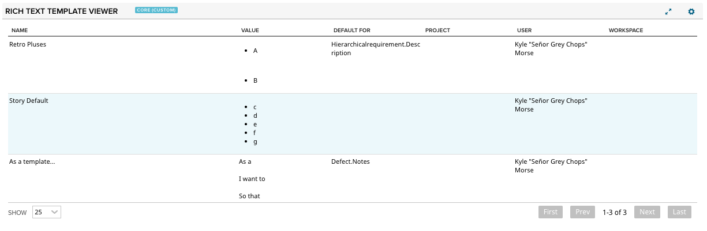

# Rich Text Template Viewer

This app was created to assist with the migration from EDP rich text templates to the fancy new templates functionality included with the upcoming QDP/FDP release.

## Installation
The app is installed as a Custom HTML App ([see help documentation](https://help.rallydev.com/custom-html))

Simply copy/paste the deployable code here: [deploy/App.html](deploy/App.html)

## Usage

Please see this community post, which has very detailed instructions on how to use this app: [https://communities.ca.com/message/242155126-product-announcement-migrate-rich-text-edp-templates-to-work-item-qdp-templates](https://communities.ca.com/message/242155126-product-announcement-migrate-rich-text-edp-templates-to-work-item-qdp-templates)
